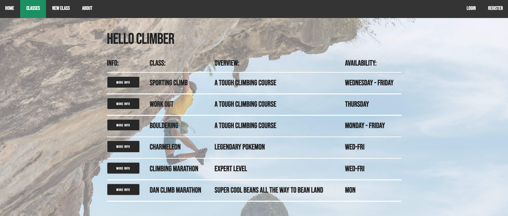

# crud-climber-app

A full Crud Climber application. This experimental application is used for checking our climbing courses and adding them to our own personal scheduler
using Authentication. A user can view upcoming climbing classes on the main page where all classes are posted. You are able to post a new class to the list of classes for everyone to see. Each user can login and select certain classes they might want to try out or leave a review ext. This project is to demenstrate understanding and experimentation with Authentication,
full stack development, model referencing, and Authentication.

## Technologies used

- HTML5
- CSS3
- JavaScript
- Node.js
- Express
- MongoDB
- Authentication with Bcrypt and Sessions
- <a href="heroku.com/">Heroku</a>

## Screenshots

- "Main Page View" 
  
- "Register page" 
  
- "Scheduler page" 
  

## Getting Started

A User must register and login in order to check our the climbing classes in detail and get access to the scheduler and other cool functionality
An authenticated user will have the full Crud functionality (Create | Read data | Update | Delete)
https://crudclimber.herokuapp.com/

## Future Enhancements

- make application mobil friendly
- add admin access so only an admin can add classes
